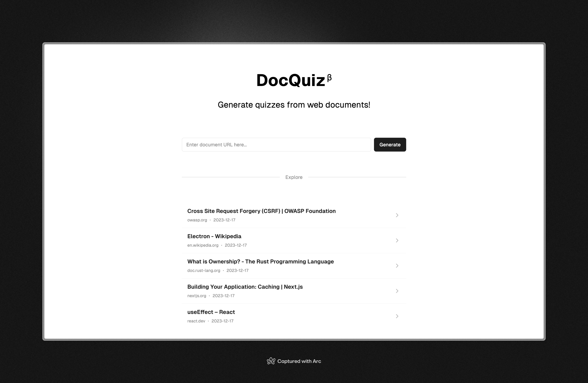

<a href="https://docquiz.vercel.app">
  
  <h1 align="center">DocQuiz</h1>
</a>

## How to use

1. Paste a document URL to the form and push "Generate"
2. The app will generate a link to the quiz
3. Solve it!

## Stack

- Next.js
- shadcn/ui
- Radix UI
- Tailwind CSS
- Supabase
- GPT-4 by OpenAI API
